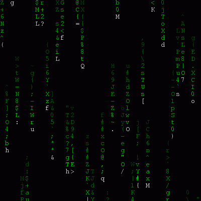
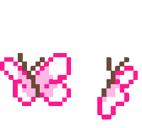

  
  
  
  
  

  

<h1>Helloo, how are you? </h1> 
<h1>I'm Bruna Sanches! 🎀💖</h1>

 
  
   

  
  

<h4>
- 🌱 I intend to be in constant learning in the field of technology.  
- 🎯 I'm a student in the Information Systems program at the Federal Institute of Paraná. 
- 🦋 If you can dream it, you can do it! 🙏🏻  
- I'm Brazilian 🇧🇷
</h4>

<h2> 💻 Tech Stack 🤩 </h2>

 
  
  
  
  
  
  
  
  
   
  
  

<h2> 👩🏻‍💻 GitHub Status 📚 </h2>

 

